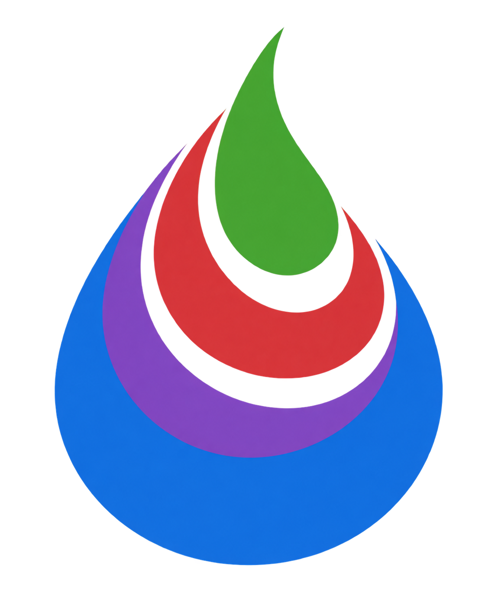

# Liquid.jl



[](https://github.com/dantebertuzzi/Liquid.jl/actions/workflows/CI.yml?query=branch%3Amain)
[](https://codecov.io/gh/dantebertuzzi/Liquid.jl)
[](https://dantebertuzzi.github.io/Liquid.jl/dev/)

A pure-Julia implementation of the [Liquid](https://shopify.github.io/liquid/)
template language.

Liquid templates are safe to accept from untrusted sources: the language has no
way to name a function, read a field its author did not expose, or reach the
host process. This package keeps that property. Rendering a template never
evaluates Julia code.

Status: v0.1 in development, not yet registered.

## Installation

```julia
using Pkg
Pkg.add(url = "https://github.com/dantebertuzzi/Liquid.jl")
```

## Usage

```julia
using Liquid

render("Hello, {{ name }}!"; name = "World")

# Parse once, render many times.
tmpl = parse_template("Hello, {{ name }}!")
render(tmpl; name = "World")
render(tmpl; name = "Liquid")

# Explicit configuration.
env = Environment(
    loader = FileSystemLoader("./templates"),
    autoescape = true,
    strict_variables = false,
)
render(get_template(env, "letter.liquid"), Dict("owners" => owners))
```

Data may be a `NamedTuple`, a `Dict` keyed by strings or symbols, or keyword
arguments.

## Exposing your own types

Structs are opaque by default: no field is reachable from a template until the
type's author says so. Only the listed names are ever read.

```julia
struct Product
    title::String
    price::Float64
    cost::Float64      # stays invisible
end

Liquid.@liquid_drop Product title price
```

Override `Liquid.liquid_get` for computed properties.

## Conformance

Validated against [Golden Liquid](https://github.com/jg-rp/golden-liquid), the
reference suite python-liquid uses.

    862 / 865 in-scope cases pass (99.7%)

The suite has 1098 cases; 233 exercise features outside the v0.1 scope
(`include`, `render`, `tablerow`, the `liquid` tag, and filters added after the
standard set) and are skipped rather than counted. Cases that do not pass yet
are listed in `test/golden/known_failures.txt` and reported as broken, not
omitted.

Three in-scope cases remain. Two of them the suite contradicts itself on: it
marks `` and a `` holding `and` valid under
one strictness mode and invalid under another, so passing one fails the other.
The third asks that slicing a range use the range's string form, so that
`{{ (1..5) | slice: 1, 3 }}` is `"..5"`; that is reproduced here as `"234"`.

## Scope of v0.1

Tags: `assign`, `capture`, `if`/`elsif`/`else`, `unless`, `case`/`when`, `for`
(with `limit`, `offset`, `reversed`, `else`, `break`, `continue`), `cycle`,
`increment`, `decrement`, `raw`, `comment`, `echo`. The standard filter set.

Not included, and planned for v0.2: `include`, `render`, template inheritance,
caching loaders, `tablerow`, and the `liquid` tag.

## License

MIT. See [CHANGELOG.md](CHANGELOG.md) for release notes.
